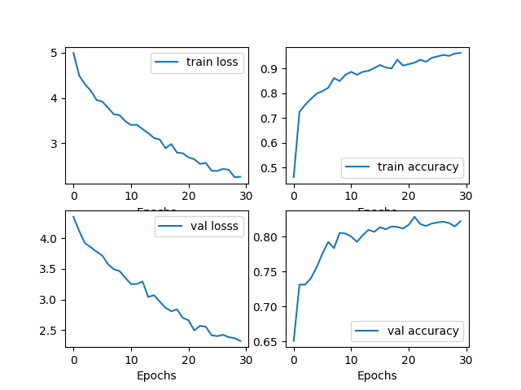

# Experience Loss: Learning From Multiple Teachers 

This is the accompanying code for our paper `Experience Loss: Learning From Multiple Teachers` currently under review at AAAI 2019. This release introduces our framework for easy training of models written in PyTorch and shows some of the utility improvements that are made under the hood. 


### Preliminaries: Requirements:
In order to train with Experience Loss, you'll need: 
1. `PyTorch > 0.4.0` 
2. `torchsummary`
3. `torchnet` (Only if you want to run model analysis)
4. `numpy`
5. `seaborn`
6. `matplotlib`


### Training existing models:

A collection of models are provided in `models` subdirectory. You can choose to train from a small `CIFARNet` to bigger models like `Wide Resnet`(), `Resnet`(He et al.). In order to train the models, simply create a folder in `experiments` and follow the steps: 

1. Define a `params.json` file. This file is contains information about Datasets, learning rate, batch size, temperature etc. If you're simply reproducing our results then you can choose any `params.json` file from `experiments/experiments` directory. 
   
2. To train the model simply call `python train.py --param_path path/to/params.json --resume_path path/to/previous/ckpt`. The resume path is optional and is only used when you want to restore parameters from previous checkpoint. 
3. The log files and other associated data will be written to the directory you created in `experiments`.

### Customizing Training Params:
It may just happen you want to tweak the `params.json` file to perform your own experiments. Although, there is no restriction on the keys, Experience Loss recognizes some of them. An example json file may look like this:
 ```json
   {
    "experiment_type":"base",
    "model_name":"cnn",
    "num_channels":32,
    "initial_channel":3, 
    "batch_size":50,
    "num_classes":10,
    "dataset":"cifar", 
    "learning_rate":1e-3, 
    "aug":"off",
    "alpha":0.0,
    "optimizer":"Adam",
    "temperature":1,
    "num_epochs":30, 
    "dropout_rate":0.5,
    "kernel_size":3, 
    "save_summary_steps":100, 
    "num_workers":4
    }
   ```

Here's what the keys mean:
1. `experiment_type`: This defines the "type" of experiment. Base is when you're training with standard Cross Entropy Loss and "experience" is when you're training with Experience Loss. 
2. `model_name`: The model you're training. For "experience" class of experiments you want to define an additional "teachers" key that is a list of all the pre-trained teachers to load. The `model_name` can be `cnn` if you want to distill the experience in a small `CIFARNet`.

3. `aug`: This parameter controls if you want to introduce data augmentations like flip, crop, normalize. If it's off then the code automatically normalizes and turns them into tensors. 
4. `alpha`: The $\alpha$ in the Experience Loss equation. 
5. `temperature`: The temperature settings for the students. You can refer to `experiments/experiments/exp_loss_*` to gain and idea as to how these files are organized. 
6. `save_summary_steps`: The number of steps after which a summary is logged and checkpoints made.
7. `optimizer`: Choice of optimizer. Currently the code supports `Adam` and `SGD` but you can define your own by editing `train.py`.


### The Reporter Interface: 

One of the key features this code introduces is a `Reporter` interface. This interface allows you to keep track of different values during training e.g. training loss, top-1 accuracy etc. Using the interface is intutitive. To create an instance of reporter class simply call `reporter = Reporter()`. Now you can pass this object to functions and monitor different variables like so:

```python
reporter.report(epoch, 'train_loss', train_loss)
reporter.report(epoch, 'train_acc', train_accuracy) 
```

The `report` method accepts 3 parameters. The current step (this can be the iteration or the epoch), the name of the variable you want to report and the actual variable. This name is referenced in the processes after training. 


### The Plotter and CSVReporter:
These are two more classes aimed at making neural network training a little bit easier. The `Plotter` interface queries the reporter and prints a plot of all the monitored variables. An example training plot is shown below: 




A plotter can be created by calling the `Plotter` class like so: 
```python
plotter = Plotter(reporter, plot_path)
``` 
The `plot_path` is the path to where you want the code to save this plot. By default the plots will be stored in the experiment directory you created as `metric_plots.png`. 

The `CSVReporter` also interfaces with the `Reporter` class and at the end of training creates a CSV file for easy exportation to Google Sheets or Microsoft Excel. It can be instantiated like so:

```python
csvreporter = CSVReporter(reporter, params, entries, csv_path)
```

Here `entries` is a customizable lists which tells the `csvreporter` the names of the columns to create. While it can accept many different entries, we adpoted a URL kind of scheme for querying appropriate sources. Hence, to create a column from a key in `params.json` an entry needs to be `params/key_name` and for a column in a `reporter` monitored variable it needs to be `reporter/variable_name`. A complete example can be found in `train.py`.  The `csv_path` is where you want the resulting CSV file to be stored. By default it is also stored in your experiment directory as `training_metrics.csv`.


**Note**: The Plotter and CSVReporter are two examples in ways reporter class can be used. We're looking for ways to reduce the memory consumption of the reporter class for large number of observations. 


### Definining your own Models 

It may just be possible you want to define your own models or test experience loss with bigger models. We provide a convention here that we observe throughout the code.

1. Define your model as `my_new_model.py` under `models` directory. 
2. In `my_new_model.py` define your model using PyTorch tools. 
3. Additionally in the same model, define the loss function you want to train your model with. 
4. Finally, define your accuracy calculation method and expose a `metrics` dictionary that contains that method


 

  
